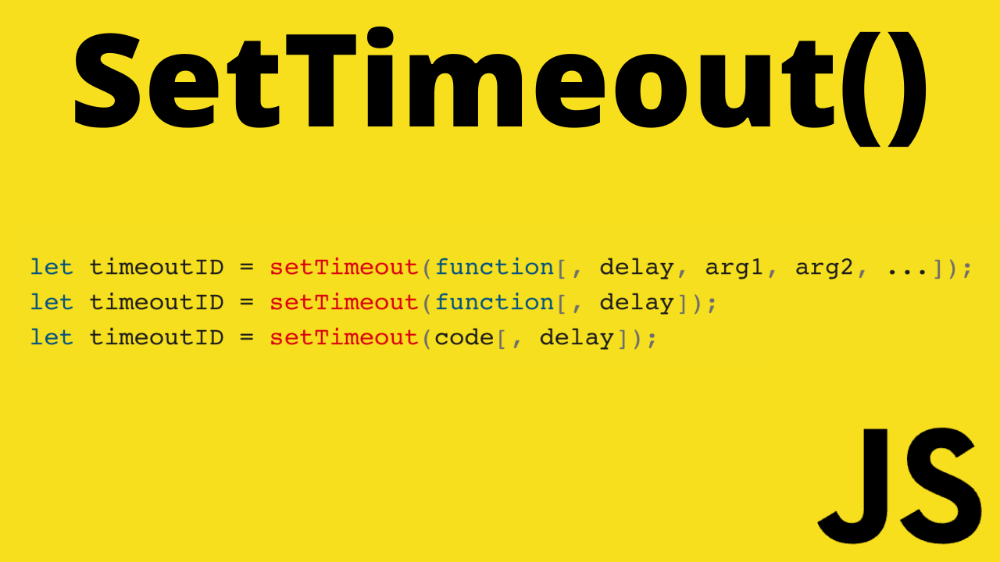

# JavaScript SetTimeout

YouTube Link: (coming soon)

In this video we are going to learn about the javascript setTimeout method. The setTimeout method allows you to set a timer and then execute a function at the end of that timer. The setTimeout timer can be canceled by calling clearTimeout and passing in the setTimeOut id(TimerId)

To help us better understand the setTimeout method we will explore the function itself and also build a sample application.

The sample application is really simple. Pressing the change color button will disable the button and start a timer. At the end of the timer the button will be re-enabled and the box in the center of the screen will change color. The timeout will be on a 2 second delay. To cancel the timer we will have a cancel button which will invoke the clearTimeout method passing in the timerID.

MDN
https://developer.mozilla.org/en-US/docs/Web/API/setTimeout
